# ReservePay — 시스템 아키텍처 및 실행 가이드

한정 수량 상품(초특가 숙소 **10개 한정**)을 동시에 다수가 구매 시도하는 상황에서,  
**초과판매 없이** 정확하게 처리하는 예약/결제 플랫폼입니다.

- 설계 배경·트레이드오프: [DECISIONS.md](DECISIONS.md)
- API 상세 명세: [API.md](API.md)

---

## 프로젝트 개요

### 아키텍처 한눈에 보기

- **Redis** — 재고 게이트(Lua 원자적 차감), 1인 1예약, Booking 분산 락(`OrderBookingLock`), 감사 로그(Stream)
- **MySQL** — 최종 정합성 방어선(`UNIQUE`·`CHECK`·트랜잭션). Redis 통과 요청도 `decreaseIfAvailable()`로 재검증
- **Strategy 패턴** — 결제 수단(카드/Y페이/포인트)을 `PaymentStrategy`로 분리, 신규 수단 추가 시 Booking 수정 최소화
- **보상 트랜잭션** — 복합 결제 일부 실패 시 성공 라인 역순 취소 + 재고 복구
- **Tomcat 동기 + Redis 1차 게이트** — 00시 버스트(500~1000 TPS)는 Redis Lua에서 대부분 즉시 매진/중복 거절, DB는 당첨 소수만 `CheckoutDbGate`(동시 10)로 보호
- **변경 노트** — 초기 `CompletableFuture` + `pgExecutor` 방안은 풀 상한(210)이 Redis보다 먼저 막혀 `503 SERVER_BUSY`가 대량 발생. API 계약(동기) 유지한 채 **Redis fast-fail → 당첨만 DB** 단일 경로로 단순화. Redis Streams는 처리 경로가 아닌 **감사 로그** 전용

### 구현 내역

1. **Redis 컴포넌트** (`redis`) — `StockGate` + `stock_decr.lua`, `StockBootstrapRunner`, `ProductCatalogCache`/`ProductCatalogBootstrapRunner`, `OrderBookingLock`, `AuditStreamPublisher`(감사 전용)
2. **JPA Repository 7종** — `Member`/`Product`/`Stock`/`Order`/`Payment`/`PaymentLine`/`PointHistory`. `StockRepository`에 `decreaseIfAvailable()`/`increase()` 조건부 쿼리
3. **결제 Strategy** (`domain/payment/strategy`) — `CreditCard`/`Ypay`/`Ypoint` 구현체, `PaymentStrategyResolver`, `PaymentCombinationValidator`
4. **도메인 예외** (`common/exception`) — `SoldOutException`, `DuplicateReservationException`, `OrderNotFoundException` 등. 서비스 계층이 HTTP와 분리
5. **CheckoutService** — `GET /api/checkout`. 오픈 확인 → `StockGate.reserve()` → 당첨만 `CheckoutDbGate` → `Order.pending()`. DB 일시 장애 시 Redis 슬롯 유지 + 재시도
6. **BookingService** — `POST /api/bookings`. `orderNo` 분산 락 → 결제 라인 순차 실행(일시 실패 최대 2회 재시도) → 실패 시 보상 트랜잭션
7. **예외·HTTP** — `ReservePayException` 하위 예외가 `toResponseEntity()` 제공. `ExceptionAdvice`는 Redis·DB 무결성 등 인프라 예외만 처리
8. **테스트** — 단위(`PaymentCombinationValidatorTest`, `YpointPaymentStrategyTest`, `ReservePayExceptionTest`) + Testcontainers 통합(`ConcurrentCheckoutIntegrationTest`, `DistributedStockConsistencyTest`, `BookingCompensationIntegrationTest`, `CheckoutSaleNotStartedTest`)
9. **빌드·실행** — `make up`(앱 1대) 기본, `make up-distributed`(Nginx + app1/app2) 분산 실증 선택
10. **Dead Letter (이중 기록)** — 결제 영구 실패: MySQL `payment_dead_letter`(진본) + Redis `dlt:payment`(관측). Checkout 재시도 소진: MySQL `booking_dead_letter` + Redis `dlt:booking`

---

## 1. 프로젝트 실행 방법

### Docker Compose로 전체 기동 (권장)

```bash
make up
# 또는
docker compose up -d --build
```

| 서비스 | 주소 |
|--------|------|
| API | `http://localhost:8081` (컨테이너 내부 8080) |
| MySQL | `localhost:3306` (user `reservepay` / password `reservepay`, db `reservepay`) |
| Redis | `localhost:6379` |

기동 확인:

```bash
curl "http://localhost:8081/api/checkout?productId=1&memberId=1"
```

### 로컬에서 Spring Boot만 실행

```bash
docker compose up -d mysql redis
docker compose run --rm db-init
./gradlew bootRun
```

로컬 앱 기본 주소: `http://localhost:8080`

### 테스트 실행

```bash
./gradlew test
```

Redis + MySQL이 필요한 통합·동시성 테스트는 Docker 데몬이 실행 중이어야 합니다 (`docker compose up -d` 또는 Testcontainers 자동 기동).

검증 목표 (통합 테스트 기준):

- **재고 10건** — 1000 동시 Checkout 요청 시 성공 정확히 10건, 초과판매 0건
- **1인 1예약** — 동일 회원 중복 Checkout 시 409
- **결제 보상** — 복합 결제 부분 실패 시 역순 환불·재고 복구

### k6 부하 테스트 (00시 트래픽 급증 시뮬레이션)

**사전 조건:** `make up`으로 API·MySQL·Redis가 기동 중이어야 합니다.  
**k6 설치:** [k6.io](https://k6.io/docs/get-started/installation/) — macOS: `brew install k6`

```bash
# 기본 (평시 50 TPS → 피크 1,000 TPS, 약 2분 20초)
bash k6/prepare-load-test.sh

# 대규모 (피크 1,000 TPS 유지 3분, 10만+ 요청)
bash k6/prepare-load-test-100k.sh
```

스크립트가 자동으로 수행하는 작업:

1. **초기화** — Redis `stock`/`reserved`/상품 캐시 삭제, MySQL 주문·DLT 정리, 재고 10 복원, `checkin_opening_at = NOW()`
2. **부하** — 무작위 `memberId`(1만~6만 풀)로 `GET /api/checkout` 동시 호출
3. **검증** — MySQL·Redis 재고, PENDING 주문 수, 당첨자 분산 확인

수동 실행:

```bash
bash k6/reset-checkout-state.sh
k6 run k6/checkout-load.js        # 또는 k6/checkout-load-100k.js
bash k6/verify-load-test.sh
```

환경 변수 (선택):

| 변수 | 기본값 | 설명 |
|------|--------|------|
| `BASE_URL` | `http://localhost:8081` | API 주소 |
| `PRODUCT_ID` | `1` | 상품 ID |
| `TOTAL_STOCK` | `10` | 한정 재고 |
| `MEMBER_POOL` | `50000` | 무작위 회원 ID 풀 크기 |

**검증 목표 (k6 + 사후 검증):**

| 항목 | 기준 |
|------|------|
| 당첨(WIN) | **정확히 10건** (`checkout_wins` = 재고 수) |
| 초과·미달 판매 | DB·Redis `remaining_stock` = 0, PENDING 주문 = 10 |
| 응답 분류 | WIN + SOLD_OUT + FAILURE 합계 = 총 요청 수 (무작위 회원으로 DUPLICATE 최소화) |
| 지연 | **p95 < 500ms** |
| 가용성 | **5xx 비율 < 1%** |
| 공정성 | 넓은 `memberId` 풀에서 무작위 추출 → 당첨 ID가 특정 구간에 편중되지 않음 |

> 00시 시나리오: 평시 **50 TPS** → **30초** 만에 **1,000 TPS** 피크 → **1~3분** 유지.  
> Redis Lua 1차 게이트가 버스트를 흡수하고, 당첨 소수만 DB(`CheckoutDbGate`)로 내려가 시스템 붕괴를 방지합니다. 상세는 [DECISIONS.md](DECISIONS.md) 참고.

---

## 2. 사전 요구 사항

| 항목 | 버전 | 용도 |
|------|------|------|
| **Docker** | 20.10+ | MySQL·Redis·앱 컨테이너 실행 (권장) |
| **Docker Compose** | v2+ | `make up` |
| **Java** | 21 | 로컬 IDE / Gradle 실행 시 |
| **Gradle** | Wrapper 포함 (`./gradlew`) | 빌드·테스트 |
| **k6** | 0.47+ (선택) | 00시 트래픽 부하 테스트 |

> **코드 수정 없이 실행**하려면 Docker만 있으면 됩니다.  
> 소스를 직접 빌드할 때만 JDK 21이 필요합니다.

---

## 3. 빠른 실행 (Docker Compose — 권장)

```bash
# 1) 저장소 루트에서
make up

# 2) API 확인 (기본 포트 8081)
curl "http://localhost:8081/api/checkout?productId=1&memberId=1"
```

`make up`이 수행하는 작업:

1. **MySQL 8.0** 기동 (`localhost:3306`)
2. **Redis 7** 기동 (`localhost:6379`)
3. **db-init** — `src/main/java/sql/schema.sql` 적용 + 시드 데이터 삽입
4. **app** — Spring Boot 앱 빌드·기동 (`localhost:8081` → 컨테이너 8080)

### 전체 흐름 예시

```bash
# Checkout — PENDING 주문 생성
ORDER_NO=$(curl -s "http://localhost:8081/api/checkout?productId=1&memberId=1" \
  | python3 -c "import sys,json; print(json.load(sys.stdin)['orderNo'])")

# Booking — 복합 결제 확정 (카드 8만 + 포인트 2만)
curl -X POST "http://localhost:8081/api/bookings" \
  -H "Content-Type: application/json" \
  -d "{
    \"orderNo\": \"$ORDER_NO\",
    \"memberId\": 1,
    \"paymentLines\": [
      { \"method\": \"CREDIT_CARD\", \"amount\": 80000 },
      { \"method\": \"YPOINT\", \"amount\": 20000 }
    ]
  }"
```

### 종료·재시작

```bash
make down          # 전체 종료
make logs          # 앱 로그
make reset-db      # DB 스키마·시드 재적용 (데이터 초기화)
make patch-db      # 기존 DB 볼륨 유지, 누락 테이블만 추가
```

### 분산 구성 (선택)

```bash
make up-distributed   # app1 + app2 + Nginx LB
make logs-distributed
```

Nginx가 `app1`/`app2`로 요청을 분산합니다. 정합성은 `DistributedStockConsistencyTest`로 검증합니다.

---

## 4. 로컬 IDE / Gradle 실행

Docker로 **MySQL·Redis만** 띄우고 앱은 IDE에서 실행할 수 있습니다.

```bash
# 1) 인프라만 기동 + 스키마 적용
docker compose up -d mysql redis
docker compose run --rm db-init

# 2) 앱 실행 (기본 http://localhost:8080)
./gradlew bootRun
```

`application.yaml` 기본값:

- MySQL: `localhost:3306/reservepay` (user/pass: `reservepay`)
- Redis: `localhost:6379`

---

## 5. 테스트 실행

```bash
./gradlew test
```

| 테스트 | 내용 |
|--------|------|
| `PaymentCombinationValidatorTest` | 복합 결제 조합 규칙 단위 테스트 |
| `YpointPaymentStrategyTest` | Y포인트 결제·환불 단위 테스트 |
| `ReservePayExceptionTest` | 예외 → HTTP 응답 계약 |
| `ConcurrentCheckoutIntegrationTest` | 50 동시 Checkout E2E (Testcontainers) |
| `DistributedStockConsistencyTest` | 1000 동시 요청, Redis·DB 초과판매 0건 |
| `BookingCompensationIntegrationTest` | 결제 실패 보상 트랜잭션 |
| `CheckoutSaleNotStartedTest` | 판매 오픈 전 403, 재고 미접촉 |

> Testcontainers 통합 테스트는 **Docker 데몬**이 실행 중이어야 합니다.

---

## 6. 시스템 아키텍처

> 상세 Redis 키·Lua·Stream: [doc1.md](doc1.md) · 설계 원칙: [doc2.md](doc2.md) · E2E 흐름: [doc3_detail.md](doc3_detail.md) · Lua·Gate·복합결제: [doc4_etc.md](doc4_etc.md)

### 6.1 구성도 (단일 앱)

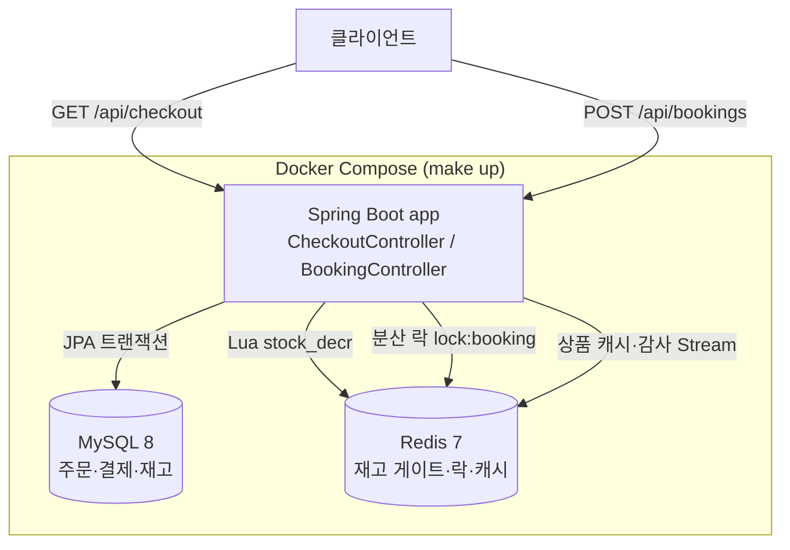

### 6.2 분산 구성 (Nginx + app1/app2)

`make up-distributed` 시 모든 앱 인스턴스가 **동일 Redis·MySQL**을 공유합니다.

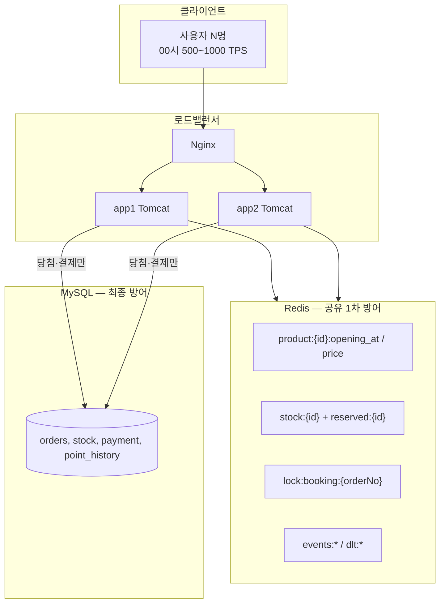

### 6.3 사용자 여정 (End-to-End)

선착순 예약은 **Checkout(재고 경쟁)** 과 **Booking(결제 확정)** 두 단계입니다.

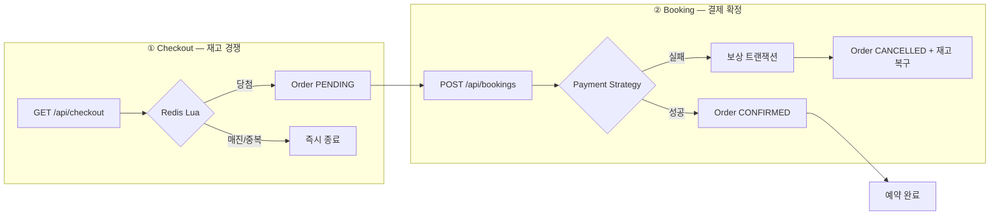

| 단계 | API | 질문 | 트래픽 규모 |
|------|-----|------|-------------|
| **Checkout** | `GET /api/checkout` | 재고 있나? 1인1예약 가능? | 00시 **500~1000 TPS** |
| **Booking** | `POST /api/bookings` | 이 주문 결제할 수 있나? | 당첨자 **~10건** |

### 6.4 통합 처리 경로

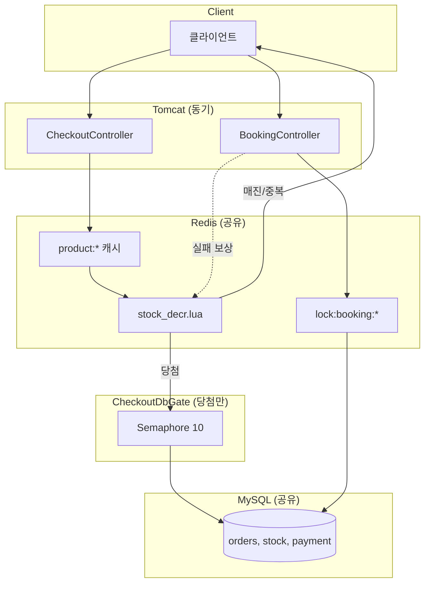

### 6.5 이중 안전망 (Defense in Depth)

| 계층 | 역할 | 대표 컴포넌트 |
|------|------|---------------|
| **1차 (Redis)** | 00시 버스트 흡수, 원자적 재고·1인1예약 | `StockGate` + `stock_decr.lua` |
| **2차 (MySQL)** | 최종 정합성, UNIQUE/CHECK, 트랜잭션 | `StockRepository.decreaseIfAvailable()`, `uk_orders_member_product` |
| **동시성 제한** | 당첨 소수만 DB 접근 | `CheckoutDbGate` (Semaphore 10) |
| **결제 보호** | 동일 주문 동시 결제 차단 | `OrderBookingLock` + `unlock.lua` |

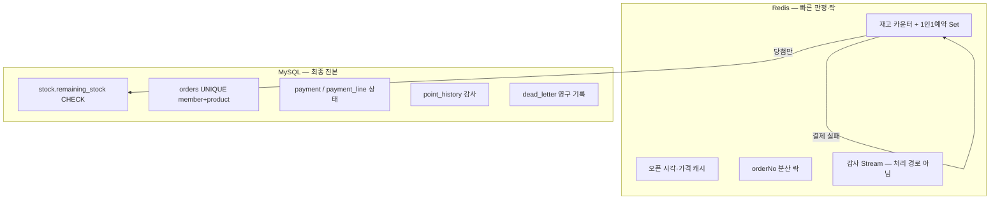

### 6.6 00시 버스트 처리

| | 구 `pgExecutor` | **현재** |
|--|----------------|----------|
| 버스트 처리 | 풀 상한에서 **503** | **Redis Lua fast-fail** (매진/중복) |
| DB 부하 | 모든 요청 경로 가능 | **당첨 ~10건만** `CheckoutDbGate` |
| 처리 경로 | CompletableFuture + 별도 풀 | **Tomcat 동기 단일 경로** |

```
1000 TPS 유입
  → 99% Redis Lua에서 즉시 종료 (매진 200 / 중복 409)
  → ~10건 CheckoutDbGate(Semaphore 10) → MySQL
  → Booking은 당첨자 수준만 처리
```

### 6.7 Redis 키 맵

| Redis 키 | 타입 | Checkout | Booking | 역할 |
|----------|------|:--------:|:-------:|------|
| `product:{id}:opening_at` | String | ✅ | — | 오픈 시각 |
| `product:{id}:price` | String | ✅ | — | 상품 가격 |
| `stock:{productId}` | String | ✅ | 보상 | 남은 재고 |
| `reserved:{productId}` | Set | ✅ | 보상 | 1인1예약 당첨자 |
| `lock:booking:{orderNo}` | String | — | ✅ | 동시 결제 차단 |
| `events:order` | Stream | ✅ | — | 주문 감사 |
| `events:payment` | Stream | — | ✅ | 결제 감사 |
| `dlt:booking` | Stream | ✅ | — | 예약 실패 로그 |
| `dlt:payment` | Stream | — | ✅ | 결제 실패 로그 |

### 6.8 패키지 구조

```
src/main/java/com/example/reservepay/
├── checkout/          # CheckoutService, CheckoutDbGate, CheckoutResponse
├── booking/           # BookingService, BookingRequest/Response
├── domain/            # Order, Payment, PaymentLine, Stock, Member, Product ...
├── redis/             # StockGate, ProductCatalogCache, OrderBookingLock, DLT Publisher
├── web/               # Controller, ExceptionAdvice, ErrorResponse
└── common/exception/  # ReservePayException 하위 예외 (checkout/booking)
```

---

## 7. 시퀀스 다이어그램 · 플로우차트

### 7.1 Checkout — 주문 생성 (재고 선점)

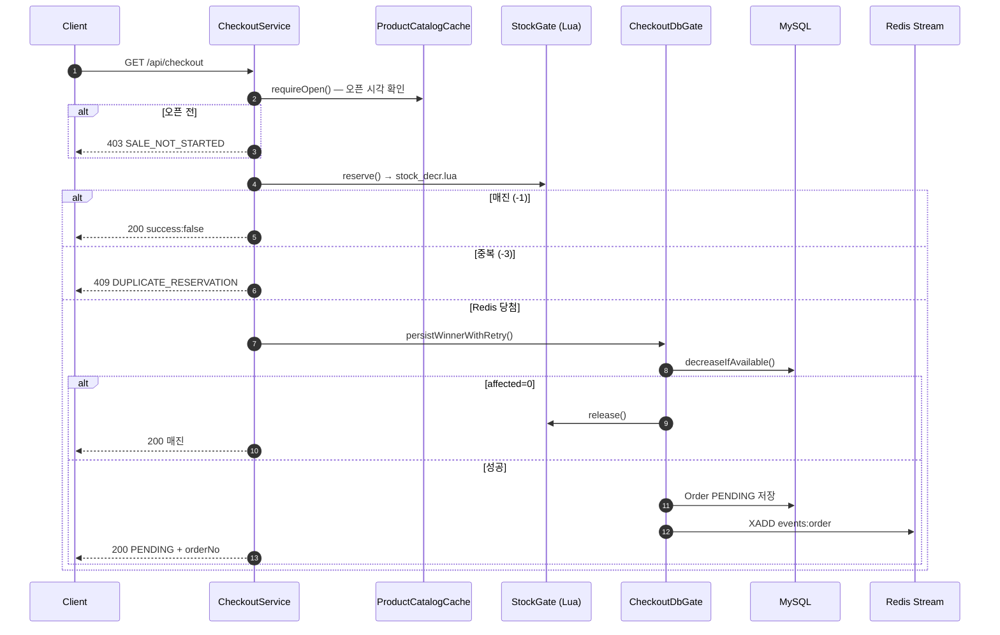

### 7.2 Checkout — Redis 상세 (당첨 후 DB 장애)

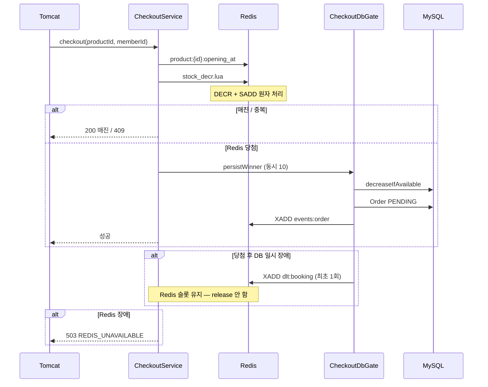

### 7.3 `stock_decr.lua` 판정 플로우

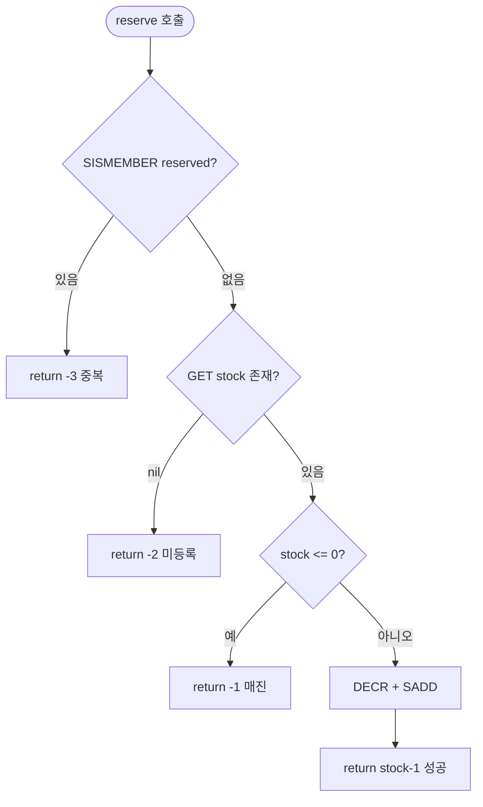

| Lua 반환 | HTTP | 의미 |
|----------|------|------|
| 양수 | **200** success | 당첨, DB 게이트로 진행 |
| `-1` | **200** `success:false` | 매진 |
| `-2` | **404** | 상품 미등록 |
| `-3` | **409** | 중복 예약 |

### 7.4 CheckoutDbGate 재시도 플로우

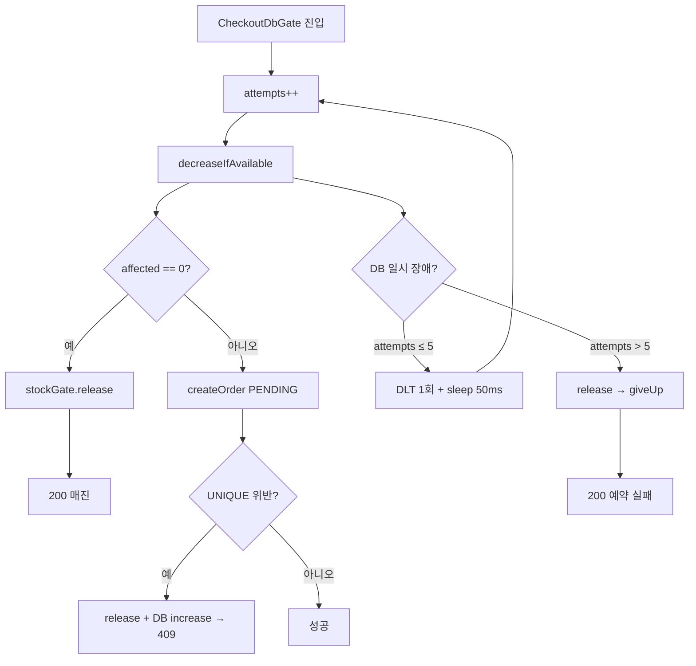

| 상황 | Redis 슬롯 | 이유 |
|------|------------|------|
| DB **일시** 장애 (재시도 중) | **유지** | 재시도로 주문 생성 가능 |
| DB **최종** 포기 | **release** | 슬롯 반환 |
| `decreaseIfAvailable` 0건 | **release** | Redis·DB 불일치 → 매진 |

### 7.5 Booking — 결제 확정 (복합 결제 + 보상)

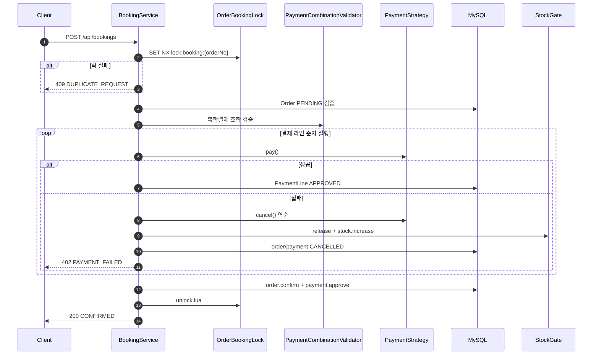

### 7.6 Booking — Redis 상세

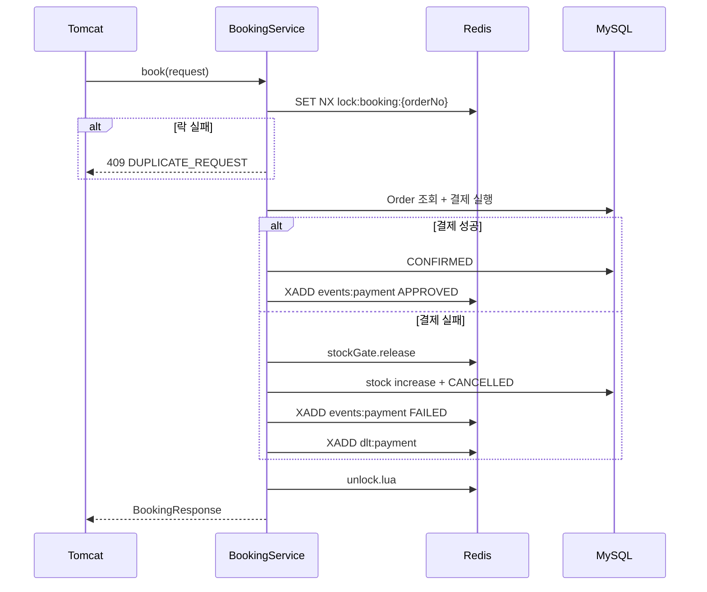

### 7.7 결제 Strategy 플로우

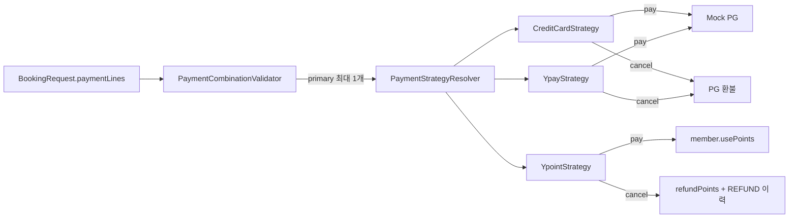

**복합결제 규칙:** primary(카드·Y페이) 최대 1개 · Y포인트 보조 허용 · 라인 합계 = 주문 금액

### 7.8 보상 트랜잭션 (결제 실패)

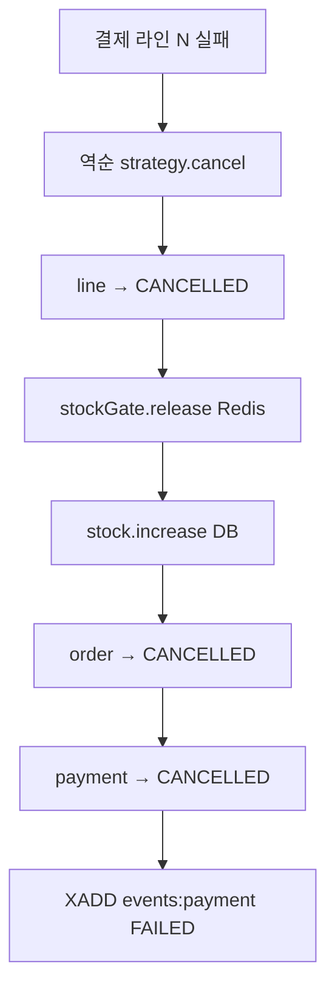

`@Transactional(noRollbackFor = PaymentFailedException.class)` — 보상 결과는 DB에 커밋, 클라이언트에는 402.

### 7.9 주문·결제 상태 전이

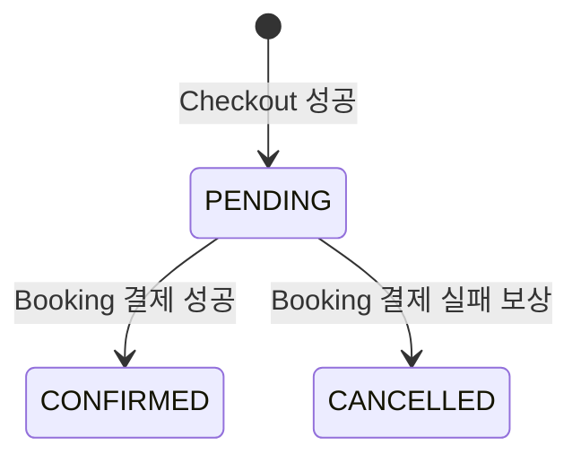

| 엔티티 | 성공 | 실패(보상) |
|--------|------|------------|
| `Order` | PENDING → **CONFIRMED** | PENDING → **CANCELLED** |
| `Payment` | PENDING → **APPROVED** | PENDING → **CANCELLED** |
| `PaymentLine` | **APPROVED** | APPROVED → **CANCELLED** |
| `stock` (Redis+DB) | -1 | +1 (`release`) |
| `PointHistory` | **USE** | **REFUND** (Y포인트) |

### 7.10 Checkout vs Booking 비교

| | Checkout | Booking |
|--|----------|---------|
| **Redis 핵심** | 상품 캐시 + `stock_decr.lua` | `lock:booking:{orderNo}` |
| **목적** | 선착순 재고·1인1예약 | 동일 주문 중복 결제 방지 |
| **DB** | 당첨만 `CheckoutDbGate` | PENDING 주문 조회 + 결제 |
| **실패 시 Redis** | 재시도 중 슬롯 유지 / 포기 시 release | 결제 실패 시 `release` |
| **트래픽** | 500~1000 TPS | ~10건 |

---

## 8. ERD (주문·결제 도메인 중심)

### 8.1 전체 ERD

```mermaid
erDiagram
    member ||--o{ orders : "places"
    product ||--|| stock : "has"
    product ||--o{ orders : "for"
    orders ||--|| payment : "1:1"
    payment ||--|{ payment_line : "contains"
    member ||--o{ point_history : "tracks"

    member {
        bigint id PK
        varchar name
        bigint point_balance
        bigint version
    }

    product {
        bigint id PK
        varchar name
        bigint price
        datetime checkin_opening_at
        int total_stock
    }

    stock {
        bigint product_id PK_FK
        int remaining_stock
        bigint version
    }

    orders {
        bigint id PK
        varchar order_no UK
        bigint member_id
        bigint product_id
        varchar status
        bigint total_amount
        varchar idempotency_key UK
    }

    payment {
        bigint id PK
        bigint order_id UK_FK
        varchar status
        bigint total_amount
    }

    payment_line {
        bigint id PK
        bigint payment_id FK
        varchar method
        bigint amount
        varchar pg_tx_id
        varchar status
    }

    point_history {
        bigint id PK
        bigint member_id
        bigint order_id
        bigint amount
        varchar type
    }

    payment_dead_letter {
        bigint id PK
        varchar order_no
        bigint member_id
        varchar method
        varchar reason
        int attempts
    }

    booking_dead_letter {
        bigint id PK
        varchar order_no
        bigint product_id
        bigint member_id
        varchar reason
        int attempts
    }
```

### 8.2 도메인 그룹

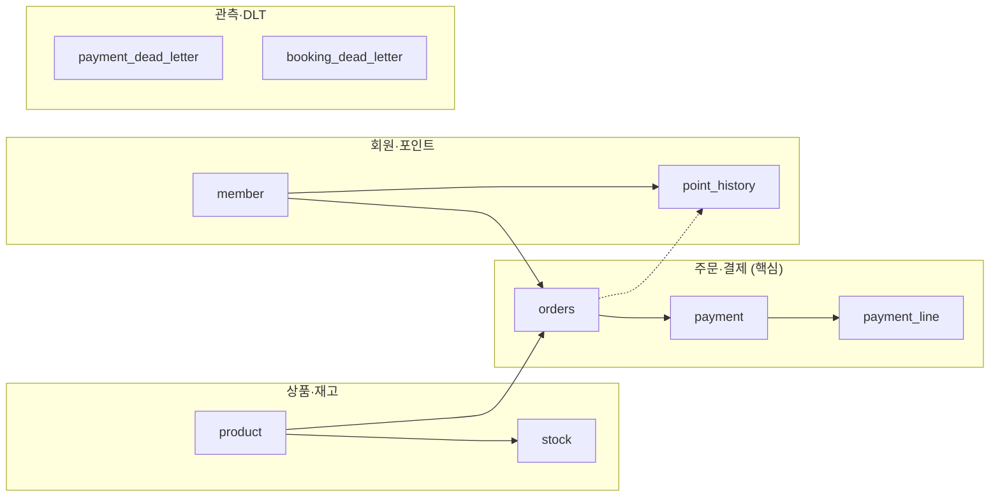

### 8.3 주요 제약 (초과판매 방지)

| 테이블 | 제약 | 목적 |
|--------|------|------|
| `orders` | `uk_orders_member_product (product_id, member_id)` | **1인 1예약** |
| `orders` | `uk_orders_idem (idempotency_key)` | Checkout 멱등 백스톱 |
| `orders` | `uk_orders_order_no (order_no)` | 외부 주문번호 유일 |
| `payment` | `uk_payment_order (order_id)` | 주문 1:1 결제 |
| `stock` | `remaining_stock >= 0` (CHECK) | 음수 재고 방지 |
| `payment_line` | `amount > 0` (CHECK) | 양수 결제 금액 |

> `orders`·`point_history`는 **FK 없음** — 회원·상품 삭제 후에도 주문·감사 이력 보존.

---

## 9. DDL 스크립트

**진본 DDL:** [`src/main/java/sql/schema.sql`](src/main/java/sql/schema.sql)

`make up` 또는 `docker compose run --rm db-init` 실행 시 자동 적용됩니다.

### 9.1 테이블 목록 (9개)

| # | 테이블 | 설명 | 도메인 |
|---|--------|------|--------|
| 1 | `member` | 회원·포인트 잔액 | 회원 |
| 2 | `product` | 상품·판매 오픈 시각 | 상품 |
| 3 | `stock` | DB 최종 재고 | 재고 |
| 4 | `orders` | 주문 (PENDING → CONFIRMED/CANCELLED) | **주문** |
| 5 | `payment` | 결제 헤더 (주문 1:1) | **결제** |
| 6 | `payment_line` | 복합 결제 라인 | **결제** |
| 7 | `point_history` | 포인트 USE/REFUND 이력 | 회원 |
| 8 | `payment_dead_letter` | 결제 영구 실패 기록 | 관측 |
| 9 | `booking_dead_letter` | Checkout 재시도 소진 기록 | 관측 |

### 9.2 주문·결제 핵심 DDL

**`orders` — 1인1예약·멱등성 UNIQUE**

```sql
CREATE TABLE orders (
    id              BIGINT      NOT NULL AUTO_INCREMENT,
    order_no        VARCHAR(36) NOT NULL COMMENT '외부 노출 주문번호',
    member_id       BIGINT      NOT NULL,
    product_id      BIGINT      NOT NULL,
    status          VARCHAR(20) NOT NULL COMMENT 'PENDING/CONFIRMED/CANCELLED',
    total_amount    BIGINT      NOT NULL,
    idempotency_key VARCHAR(80) NOT NULL COMMENT 'checkout:{productId}:{memberId}',
    created_at      DATETIME(6) NOT NULL DEFAULT CURRENT_TIMESTAMP(6),
    updated_at      DATETIME(6) NOT NULL DEFAULT CURRENT_TIMESTAMP(6) ON UPDATE CURRENT_TIMESTAMP(6),
    PRIMARY KEY (id),
    UNIQUE KEY uk_orders_order_no (order_no),
    UNIQUE KEY uk_orders_idem (idempotency_key),
    UNIQUE KEY uk_orders_member_product (product_id, member_id),
    CONSTRAINT ck_orders_amount CHECK (total_amount >= 0)
) ENGINE = InnoDB DEFAULT CHARSET = utf8mb4;
```

**`payment` + `payment_line` — 복합 결제**

```sql
CREATE TABLE payment (
    id           BIGINT      NOT NULL AUTO_INCREMENT,
    order_id     BIGINT      NOT NULL,
    status       VARCHAR(20) NOT NULL COMMENT 'PENDING/APPROVED/CANCELLED',
    total_amount BIGINT      NOT NULL,
    PRIMARY KEY (id),
    UNIQUE KEY uk_payment_order (order_id),
    CONSTRAINT fk_payment_order FOREIGN KEY (order_id) REFERENCES orders (id)
) ENGINE = InnoDB DEFAULT CHARSET = utf8mb4;

CREATE TABLE payment_line (
    id         BIGINT       NOT NULL AUTO_INCREMENT,
    payment_id BIGINT       NOT NULL,
    method     VARCHAR(20)  NOT NULL COMMENT 'CREDIT_CARD/YPAY/YPOINT',
    amount     BIGINT       NOT NULL,
    pg_tx_id   VARCHAR(100) NULL,
    status     VARCHAR(20)  NOT NULL COMMENT 'APPROVED/CANCELLED',
    PRIMARY KEY (id),
    CONSTRAINT fk_payment_line_payment FOREIGN KEY (payment_id) REFERENCES payment (id),
    CONSTRAINT ck_payment_line_amount CHECK (amount > 0)
) ENGINE = InnoDB DEFAULT CHARSET = utf8mb4;
```

**`stock` — DB 최종 방어선**

```sql
CREATE TABLE stock (
    product_id      BIGINT      NOT NULL,
    remaining_stock INT         NOT NULL COMMENT '조건부 UPDATE로만 차감',
    version         BIGINT      NOT NULL DEFAULT 0,
    PRIMARY KEY (product_id),
    CONSTRAINT fk_stock_product FOREIGN KEY (product_id) REFERENCES product (id),
    CONSTRAINT ck_stock_remaining CHECK (remaining_stock >= 0)
) ENGINE = InnoDB DEFAULT CHARSET = utf8mb4;

-- 런타임 차감 (JPA @Modifying)
-- UPDATE stock SET remaining_stock = remaining_stock - 1
-- WHERE product_id = ? AND remaining_stock > 0;
```

**Dead Letter — 영구 실패 관측**

```sql
CREATE TABLE payment_dead_letter (
    id         BIGINT       NOT NULL AUTO_INCREMENT,
    order_no   VARCHAR(36)  NOT NULL,
    member_id  BIGINT       NOT NULL,
    method     VARCHAR(20)  NOT NULL,
    amount     BIGINT       NOT NULL,
    reason     VARCHAR(255) NOT NULL,
    attempts   INT          NOT NULL,
    PRIMARY KEY (id)
) ENGINE = InnoDB DEFAULT CHARSET = utf8mb4;

CREATE TABLE booking_dead_letter (
    id         BIGINT       NOT NULL AUTO_INCREMENT,
    order_no   VARCHAR(36)  NOT NULL,
    product_id BIGINT       NOT NULL,
    member_id  BIGINT       NOT NULL,
    reason     VARCHAR(255) NOT NULL,
    attempts   INT          NOT NULL,
    PRIMARY KEY (id)
) ENGINE = InnoDB DEFAULT CHARSET = utf8mb4;
```

### 9.3 시드 데이터

`src/main/java/sql/schema.sql` 기준:

| 상품 | 재고 | 가격 | 판매 오픈 (`checkin_opening_at`) |
|------|------|------|----------------------------------|
| 시그니처 8월 첫째주 주말 오션뷰 스위트 초특가 (id=1) | 10 | 100,000원 | `2026-06-20 00:00:00` |

| 회원 | id | 포인트 잔액 |
|------|-----|-------------|
| 테스터1 | 1 | 50,000 |
| 테스터2 | 2 | 0 |
| 테스터3 | 3 | 100,000 |
| 테스터4~20 | 4~20 | 0 / 5만 / 10만 교차 |

> 오픈 시각 이전에는 Checkout이 `403 SALE_NOT_STARTED`를 반환합니다.  
> 테스트·부하 테스트 시 과거 시각으로 변경하거나 `k6/reset-checkout-state.sh`가 `NOW()`로 설정합니다.

```sql
UPDATE product SET checkin_opening_at = '2020-01-01 00:00:00' WHERE id = 1;
```

---

## 10. API 사용법

상세 명세: [API.md](API.md)

### 10.1 `GET /api/checkout` — 주문 생성 (재고 선점)

```bash
# Docker (기본 포트 8081)
curl "http://localhost:8081/api/checkout?productId=1&memberId=1"

# 로컬 bootRun (포트 8080)
curl "http://localhost:8080/api/checkout?productId=1&memberId=1"
```

**성공 응답 (200):**

```json
{
  "orderNo": "4b575809-968a-4966-91af-f4b3e5f085c3",
  "status": "PENDING",
  "totalAmount": 100000,
  "success": true,
  "message": null
}
```

**매진 응답 (200)** — HTTP 4xx가 아님:

```json
{
  "orderNo": null,
  "status": null,
  "totalAmount": 0,
  "success": false,
  "message": "판매가 종료되었습니다."
}
```

| HTTP | code / body | 의미 |
|------|-------------|------|
| **200** | `success: true`, `PENDING` | 주문 생성 성공 |
| **200** | `success: false`, "판매가 종료되었습니다." | 매진 |
| **200** | `success: false`, "예약에 실패하셨습니다." | DB 재시도 소진 |
| **403** | `SALE_NOT_STARTED` | 오픈 전 |
| **404** | `PRODUCT_NOT_FOUND` | 상품 없음 |
| **409** | `DUPLICATE_RESERVATION` | 1인 1예약 위반 |
| **503** | `REDIS_UNAVAILABLE` | Redis 장애 (fail-closed) |

### 10.2 `POST /api/bookings` — 결제 확정

```bash
curl -X POST http://localhost:8081/api/bookings \
  -H "Content-Type: application/json" \
  -d '{
        "orderNo": "4b575809-968a-4966-91af-f4b3e5f085c3",
        "memberId": 1,
        "paymentLines": [
          { "method": "CREDIT_CARD", "amount": 80000 },
          { "method": "YPOINT", "amount": 20000 }
        ]
      }'
```

**결제 규칙**

- `method`: `CREDIT_CARD` / `YPAY` / `YPOINT`
- 카드와 Y페이는 **동시 사용 불가** (primary 최대 1개)
- Y포인트는 보조 수단으로 primary와 조합 가능
- `paymentLines` 금액 합계 = 주문 `totalAmount` (100,000원)
- 동일 `orderNo` 동시 결제 → `409 DUPLICATE_REQUEST` (Redis 분산 락)

**성공 응답 (200):**

```json
{
  "orderNo": "4b575809-968a-4966-91af-f4b3e5f085c3",
  "status": "CONFIRMED",
  "success": true,
  "message": null
}
```

**실패 응답 (402)** — 보상 완료 후:

```json
{
  "orderNo": "fa3dcdb9-...",
  "status": "FAILED",
  "success": false,
  "message": "포인트 잔액이 부족합니다."
}
```

> DB에는 `order.status = CANCELLED`로 저장됩니다. API 응답 `status`는 `FAILED`.

| HTTP | code | 의미 |
|------|------|------|
| **200** | — | 결제 확정 성공 (`CONFIRMED`) |
| **402** | `PAYMENT_FAILED` | 결제 실패, 보상 처리 완료 |
| **404** | `ORDER_NOT_FOUND` | 주문 없음 |
| **409** | `DUPLICATE_REQUEST` | 동일 주문 동시 결제 |
| **409** | `INVALID_ORDER_STATE` | PENDING이 아닌 주문 |
| **422** | `INVALID_PAYMENT_COMBINATION` | 카드+Y페이 혼용 등 조합 오류 |
| **503** | `REDIS_UNAVAILABLE` | Redis 장애 |

### 10.3 API 요약표

| API | 메서드 | 성공 | 주요 실패 |
|-----|--------|------|-----------|
| `/api/checkout` | GET | 200 PENDING | 403 오픈 전, 404 상품 없음, 409 중복예약, 200 매진 |
| `/api/bookings` | POST | 200 CONFIRMED | 402 결제 실패, 404 주문 없음, 409 락/상태, 422 조합 오류 |

복합결제 body 예시는 [doc4_etc.md](doc4_etc.md) §3 참고.

---

## 11. 트러블슈팅

### `booking_dead_letter` 테이블이 없음

기존 Docker 볼륨에 스키마가 오래된 경우:

```bash
make patch-db
# 또는
make reset-db   # 데이터 초기화됨
```

### `403 SALE_NOT_STARTED`

시드 상품의 `checkin_opening_at`이 미래일 수 있습니다. 위 9.3절 SQL로 과거 시각으로 변경하세요.

### `503 REDIS_UNAVAILABLE`

Redis가 중단된 상태입니다. fail-closed 정책으로 의도된 동작입니다.

```bash
docker compose up -d redis
```

### 통합 테스트 실패 (Testcontainers)

Docker 데몬이 실행 중인지 확인하세요.

```bash
docker info
./gradlew test
```

---

## 12. 관련 문서

| 문서 | 내용 |
|------|------|
| [DECISIONS.md](DECISIONS.md) | 기술적 쟁점·라이브러리 선택 근거 |
| [API.md](API.md) | API 상세 명세 |
| [doc1.md](doc1.md) | Redis 키·Lua·Stream 상세 |
| [doc2.md](doc2.md) | 설계 원칙·pgExecutor 제거 |
| [doc3_detail.md](doc3_detail.md) | E2E 흐름·보상·상태 전이 |
| [doc4_etc.md](doc4_etc.md) | Lua 단계별·CheckoutDbGate·복합결제 예시 |
