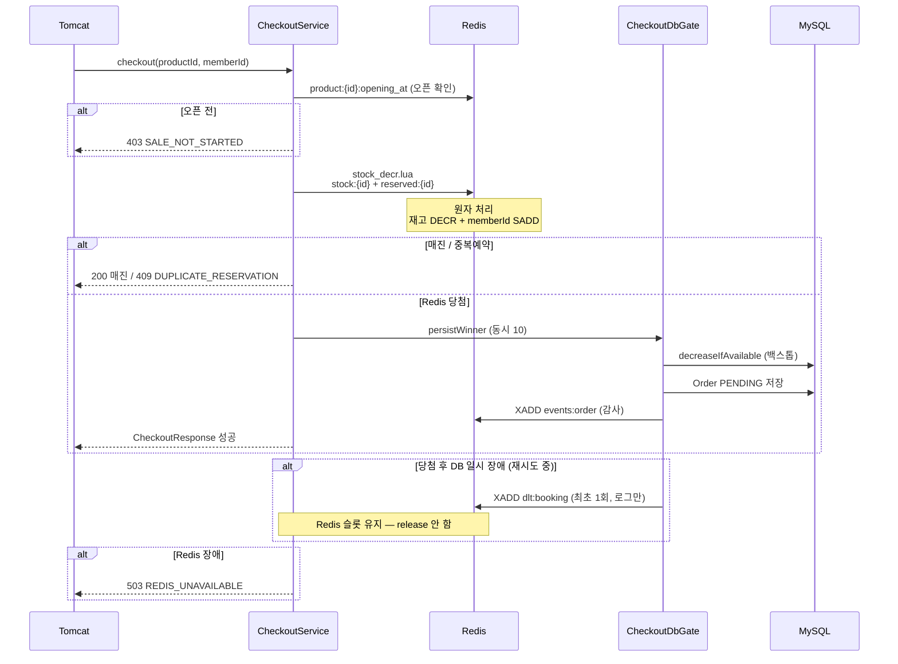
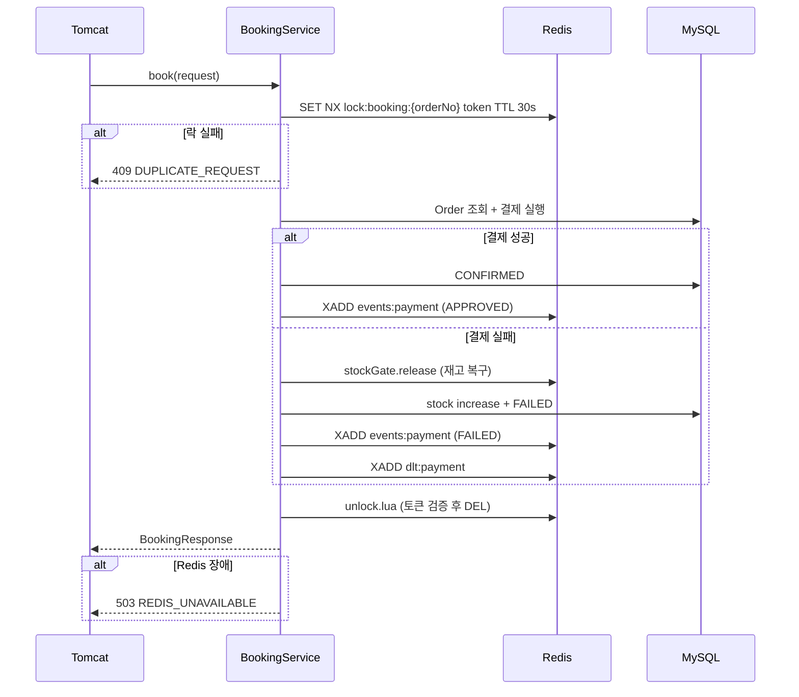

# Checkout · Booking Redis 사용 정리

ReservePay에서 Checkout과 Booking이 Redis를 어떻게 쓰는지 정리한 문서입니다.  
설계 원칙·`pgExecutor` 제거·00시 버스트 대응은 [doc2.md](doc2.md)를 참고하세요.

---

## Redis 키 한눈에 보기

| Redis 키 | 타입 | Checkout | Booking | 역할 |
|---|---|:---:|:---:|---|
| `product:{id}:opening_at` | String | ✅ | — | 오픈 시각 (`checkin_opening_at`) |
| `product:{id}:price` | String | ✅ | — | 상품 가격 (당첨 시 주문 생성용) |
| `stock:{productId}` | String (숫자) | ✅ | 보상 시 | 남은 재고 카운터 |
| `reserved:{productId}` | Set (memberId) | ✅ | 보상 시 | 1인 1예약 당첨자 |
| `lock:booking:{orderNo}` | String (토큰) | — | ✅ | 동시 결제 차단 |
| `events:order` | Stream | ✅ | — | 주문 생성 감사 로그 |
| `events:payment` | Stream | — | ✅ | 결제 결과 감사 로그 |
| `dlt:booking` | Stream | ✅ | — | 예약 실패 실시간 로그 |
| `dlt:payment` | Stream | — | ✅ | 결제 실패 실시간 로그 |

앱 기동 시 부트스트랩:

| Runner | 동기화 내용 |
|---|---|
| `StockBootstrapRunner` | DB `stock` → `stock:{id}` (`SET NX`) |
| `ProductCatalogBootstrapRunner` | DB `product` → `product:{id}:opening_at`, `product:{id}:price` |

> Redis 호출은 `StringRedisTemplate` **동기 블로킹**입니다. Tomcat 스레드가 응답까지 기다리지만, Lua/Lock은 ms 단위로 끝납니다.

---

## HTTP 처리 방식

Checkout/Booking 컨트롤러는 모두 **Tomcat 동기 HTTP**입니다. 별도 `pgExecutor` 스레드 풀은 사용하지 않습니다.

```
클라이언트 → Tomcat (동기) → Redis / DB → 응답
```

---

## Checkout — Redis 사용 흐름



### 1. 상품 캐시 (`ProductCatalogCache`)

Checkout 핫 패스에서 DB `product` 조회를 피합니다.

- `requireOpen(productId)` — Redis `opening_at`으로 오픈 여부 확인 (오픈 전이면 `403`, **재고 Lua 미호출**)
- `resolve(productId)` — 당첨 후 가격 조회 (`price` 키)
- 캐시 miss 시 DB 1회 로드 후 Redis에 `set`

### 2. 재고 게이트 (`StockGate` + `stock_decr.lua`)

가장 중요한 부분입니다. **앱이 2대여도** 모든 요청이 같은 Redis Lua를 통과합니다.

```
stock:1 = "10"          ← 남은 재고
reserved:1 = {1, 5, 9}  ← 이미 당첨한 memberId
```

Lua가 한 번에 처리합니다:

1. `reserved`에 memberId 있으면 → 중복 예약 (`-3`)
2. `stock` 없으면 → 상품 미등록 (`-2`)
3. `stock <= 0` → 매진 (`-1`)
4. `DECR` + `SADD` → 성공

**00시 버스트(500~1000 TPS)** 의 대부분은 여기서 즉시 종료됩니다 (`503`이 아닌 매진/중복).

### 3. 당첨자 DB 게이트 (`CheckoutDbGate`)

Redis Lua를 통과한 **소수(재고 수만큼)** 만 DB에 접근합니다.

- `Semaphore(10)` — HikariCP 풀 크기와 동일
- `decreaseIfAvailable()` + `Order.pending()` 저장
- DB 일시 장애 시 Redis 슬롯 유지 + 재시도 (최대 5회)

### 4. 보상 (`StockGate.release`)

Checkout 중 DB 최종 포기·Booking 결제 실패 시:

```
SREM reserved:{productId} memberId
INCR stock:{productId}
```

### 5. Checkout 실패 응답 요약

| 상황 | HTTP | 비고 |
|---|---|---|
| 매진 | **200** | `success:false` "판매가 종료되었습니다." |
| 중복 예약 | **409** | `DUPLICATE_RESERVATION` |
| 오픈 전 | **403** | `SALE_NOT_STARTED` |
| Redis 장애 | **503** | `REDIS_UNAVAILABLE` (fail-closed) |
| DB 재시도 소진 (당첨 후) | **200** | `success:false` "예약에 실패하셨습니다." |

### 6. Stream (처리 경로 아님)

| Stream | 시점 | 진본 |
|---|---|---|
| `events:order` | 주문 `PENDING` 생성 시 | — |
| `dlt:booking` | 당첨 후 DB 일시 장애 재시도 중 **최초 1회** | MySQL `booking_dead_letter` |

---

## Booking — Redis 사용 흐름



### 1. 분산 락 (`OrderBookingLock`)

```
lock:booking:{orderNo} = "uuid-token"   TTL 30초
```

- `SET NX`로 **같은 orderNo 동시 결제 1건만** 허용
- 끝나면 `unlock.lua`로 **본인 토큰일 때만** 삭제
- Checkout 때 잡아둔 `reserved`/`stock`과는 **별개** (역할: 중복 결제 방지)

### 2. 결제 실패 시 재고 복구

Booking은 **새로 재고를 차감하지 않습니다**. Checkout에서 이미 잡아둔 슬롯을 결제 실패 시 되돌립니다.

```java
stockGate.release(order.getProductId(), order.getMemberId());
stockRepository.increase(order.getProductId());
```

### 3. Stream

| Stream | 시점 | 진본 |
|---|---|---|
| `events:payment` | `APPROVED` / `FAILED` | — |
| `dlt:payment` | 결제 영구 실패 시 | MySQL `payment_dead_letter` |

---

## Audit Stream 역할 분리

감사 Stream은 **도메인별로 한 곳만** 기록합니다.

| 단계 | `events:order` | `events:payment` |
|---|---|---|
| **Checkout** | `PENDING` | — |
| **Booking 성공** | — | `APPROVED` |
| **Booking 실패** | — | `FAILED` |

주문 최종 상태(`CONFIRMED` / `FAILED`)는 DB `orders`가 진본입니다. Stream은 감사·구독용이며, Booking에서 `events:order`에 중복 기록하지 않습니다.

---

## Checkout vs Booking 비교

| | Checkout | Booking |
|---|---|---|
| **Redis 핵심** | 상품 캐시 + 재고 Lua (`stock` + `reserved`) | 분산 락 (`lock:booking`) |
| **목적** | 선착순 재고 경쟁·1인1예약 | 동일 주문 중복 결제 방지 |
| **DB와 관계** | Redis 통과 **당첨만** `CheckoutDbGate` → DB | DB 주문 조회 후 결제 (소수) |
| **실패 시 Redis** | 재시도 중 슬롯 유지 / 최종 포기 시 release | 결제 실패 시 `release` |
| **Stream** | `events:order`, `dlt:booking` | `events:payment`, `dlt:payment` |
| **트래픽 규모** | 00시 500~1000 TPS (대부분 Redis에서 종료) | 당첨자 ~10건 수준 |

---

## 왜 이렇게 나눴나

```
Checkout  →  "재고 있는가?" (폭주 구간, Redis Lua가 1차 방어)
Booking   →  "이 주문 결제 중복 아닌가?" (orderNo 단위 락)
MySQL     →  최종 정합성 (UNIQUE, 조건부 UPDATE)
```

**00시 버스트**는 Checkout의 `ProductCatalogCache` + `stock_decr.lua`에서 대부분 걸러지고, 통과한 ~10건만 `CheckoutDbGate`를 통해 DB로 내려갑니다. Booking은 그때부터 **결제 + 락**만 담당합니다.

모든 앱 인스턴스가 **동일 Redis**를 공유하므로 (`docker-compose` `app1`/`app2` → 같은 `redis` 호스트), 분산 환경에서도 재고·중복 결제 정합성의 핵심이 됩니다. 자동 검증: `DistributedStockConsistencyTest`.

Redis 장애 시 `ExceptionAdvice`가 `503 REDIS_UNAVAILABLE`로 **fail-closed**합니다. 재고 게이트를 신뢰할 수 없으면 판매를 계속하지 않습니다.

---

## Lua 스크립트

### `stock_decr.lua`

Checkout 1차 방어선. 재고 확인 → 차감 → 1인 1예약 등록을 **단일 Lua 스크립트로 원자 수행**합니다.

**키·인자**

| | |
|---|---|
| `KEYS[1]` | `stock:{productId}` — 남은 재고 수 |
| `KEYS[2]` | `reserved:{productId}` — 당첨 memberId 집합 |
| `ARGV[1]` | `memberId` |

**처리 순서**

1. 1인 1예약 검사 — 이미 `reserved`에 있으면 재고와 무관하게 거절
2. 재고 키 존재 여부 — `nil`이면 상품 미등록/미동기화
3. 재고 0 이하 — 매진
4. `DECR` + `SADD` — 차감과 당첨자 기록을 한 번에 확정

**반환값** (`StockGate.reserve()`가 해석)

| 반환값 | 의미 | 예외 |
|---|---|---|
| 양수 | 성공. 차감 후 남은 재고 수 | — |
| `-1` | 매진 (`stock <= 0`) | `SoldOutException` → HTTP 200 |
| `-2` | `stock` 키 없음 | `ProductNotFoundException` |
| `-3` | 동일 회원 중복 예약 | `DuplicateReservationException` |

### `unlock.lua`

Booking 분산 락 해제. **토큰이 일치할 때만** 락을 삭제합니다 (다른 스레드의 락을 지우지 않음).

```
KEYS[1] = lock:booking:{orderNo}
ARGV[1] = lock token
```

---

## 주요 파일

| 영역 | 경로 |
|---|---|
| Checkout | `checkout/CheckoutService.java`, `checkout/CheckoutDbGate.java` |
| Booking | `booking/BookingService.java` |
| 상품 캐시 | `redis/ProductCatalogCache.java`, `redis/ProductCatalogBootstrapRunner.java` |
| 재고 게이트 | `redis/StockGate.java` |
| 분산 락 | `redis/OrderBookingLock.java` |
| 재고 초기화 | `redis/StockBootstrapRunner.java` |
| 감사 Stream | `redis/AuditStreamPublisher.java` |
| DLT Stream | `redis/BookingDeadLetterPublisher.java`, `redis/PaymentDeadLetterPublisher.java` |
| 컨트롤러 | `web/CheckoutController.java`, `web/BookingController.java` |
| 인프라 예외 | `web/ExceptionAdvice.java` |
| Lua | `resources/scripts/stock_decr.lua`, `resources/scripts/unlock.lua` |
