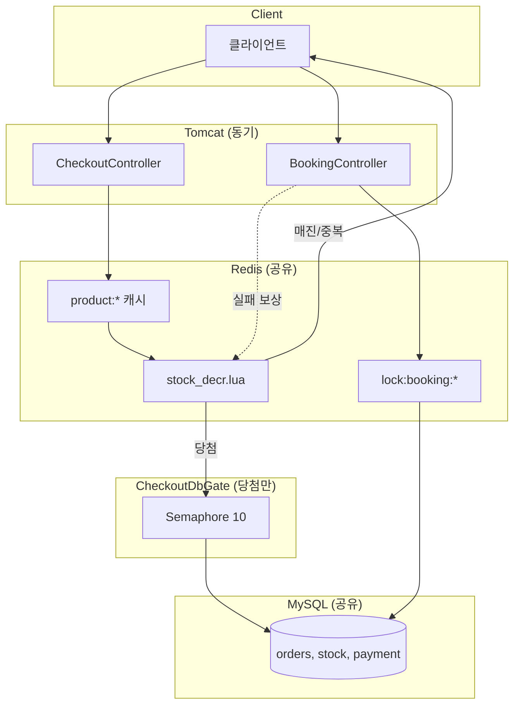

# ReservePay 설계 원칙 · 아키텍처 단순화 정리

`doc1.md`(Redis 키·Lua·Stream 상세)를 보완하는 문서입니다.  
00시 버스트 대응, `pgExecutor` 제거, Checkout/Booking 단일화 원칙을 정리합니다.

---

## 핵심 원칙 4가지

| # | 원칙 | 요약 |
|---|---|---|
| 1 | **실패는 Redis에서 빨리** | `503`이 아니라 매진/중복 |
| 2 | **DB는 소수만** | 당첨자·결제 확정 |
| 3 | **Redis 장애는 fail-closed** | `503 REDIS_UNAVAILABLE` |
| 4 | **앱 여러 대도 같은 Redis** | 분산 정합성 |

---

## 1. 실패는 Redis에서 빨리 — 503이 아니라 매진/중복

### Checkout (핵심)

```java
productCatalogCache.requireOpen(productId);  // Redis: 오픈 시각
stockGate.reserve(productId, memberId);      // Redis Lua: 재고 + 1인1예약
// ↑ 여기서 대부분 끝. DB는 당첨자만
```

| 실패 유형 | 발생 위치 | HTTP | 응답 |
|---|---|---|---|
| 오픈 전 | `ProductCatalogCache` | **403** | `SALE_NOT_STARTED` |
| 매진 | `stock_decr.lua` → `-1` | **200** | `success:false` "판매가 종료되었습니다." |
| 중복 예약 | `stock_decr.lua` → `-3` | **409** | `DUPLICATE_RESERVATION` |
| 상품 없음 | Lua `-2` / 캐시 miss | **404** | `PRODUCT_NOT_FOUND` |

**00시 500~1000 TPS**에서 99% 이상이 Redis에서 즉시 거절됩니다. `503 SERVER_BUSY`는 **사용하지 않습니다** (구 `pgExecutor` 제거).

### Booking (역할이 다름)

Booking은 재고 경쟁이 아니라 **이미 생성된 PENDING 주문 결제**입니다.

| 실패 유형 | 발생 위치 | HTTP |
|---|---|---|
| 동시 결제 (같은 orderNo) | `OrderBookingLock` SET NX 실패 | **409** `DUPLICATE_REQUEST` |
| 주문 없음 / 상태 오류 | DB | **404** / **409** |
| 결제 실패 | Payment Strategy | **402** `PAYMENT_FAILED` |

매진 판정은 Checkout에서 이미 끝났고, Booking의 Redis fast-fail은 **중복 결제 차단**입니다.

---

## 2. DB는 소수만 — 당첨자·결제 확정

### Checkout

```
[대부분]  Redis만 → 종료 (DB 접촉 없음)
[당첨 ~10] Redis 통과 → CheckoutDbGate(동시 10) → decreaseIfAvailable + Order 저장
```

| 단계 | DB |
|---|---|
| 오픈 확인 | ❌ `product:{id}:opening_at` (Redis) |
| 재고 경쟁 | ❌ `stock_decr.lua` |
| 주문 생성 | ✅ 당첨자만 `CheckoutDbGate` |

`ProductCatalogCache`는 기동 시 `ProductCatalogBootstrapRunner`가 채웁니다. 캐시 miss 시에만 DB 1회 로드 후 Redis에 캐시합니다.

### Booking

- Checkout 당첨자(~10명)만 `PENDING` 주문을 갖습니다 → Booking DB 트래픽 자체가 소수
- Redis: `lock:booking:{orderNo}` + 결제 실패 시 `stockGate.release()` 보상

---

## 3. Redis 장애는 fail-closed — 503 REDIS_UNAVAILABLE

```java
@ExceptionHandler({RedisConnectionFailureException.class, RedisSystemException.class})
public ResponseEntity<ErrorResponse> handleRedisUnavailable(Exception e) {
    return ResponseEntity.status(HttpStatus.SERVICE_UNAVAILABLE)
            .body(new ErrorResponse("REDIS_UNAVAILABLE", e.getMessage()));
}
```

| API | Redis 장애 시 |
|---|---|
| Checkout | `requireOpen` / `reserve` 중 예외 → **503** (판매 중단) |
| Booking | `lock.acquire` / `release` / `stockGate.release` 중 예외 → **503** |

`CheckoutService`는 Redis 예외를 삼키지 않습니다.  
당첨 후 **DB만** 일시 장애인 경우: Redis 슬롯 유지 + 재시도 → 최종 `200` "예약에 실패하셨습니다." (별도 정책).

> **참고:** Redis 호출은 `StringRedisTemplate` **동기 블로킹**입니다. 비동기(`ReactiveRedis`, `CompletableFuture`)가 아닙니다. 다만 ms 단위로 끝나 버스트를 흡수합니다.

---

## 4. 앱 여러 대도 같은 Redis — 분산 정합성

### 인프라

`docker-compose.yml`: `app1`, `app2` → 동일 `SPRING_DATA_REDIS_HOST: redis`

### 공유 키

| 키 | Checkout | Booking |
|---|---|---|
| `stock:{productId}` | Lua 원자 차감 | 실패 시 `INCR` 복구 |
| `reserved:{productId}` | 1인1예약 Set | 실패 시 `SREM` |
| `lock:booking:{orderNo}` | — | 분산 락 |
| `product:{id}:opening_at` | 오픈 확인 | — |
| `product:{id}:price` | 당첨 시 가격 | — |

앱 인스턴스 수와 무관하게 **같은 Redis**를 통과합니다.

### 테스트 증거

`DistributedStockConsistencyTest`: 스레드 풀 2개(앱 2대 시뮬레이션) + 1000 동시 요청 → Redis·DB 모두 재고 10개만 차감, 초과판매 0건.

---

## 원칙별 Checkout / Booking 총평

| 원칙 | Checkout | Booking |
|---|:---:|:---:|
| Redis에서 빠른 실패 (503 아님) | ✅ | ✅ (중복 락) |
| DB는 소수만 | ✅ | ✅ |
| Redis 장애 fail-closed | ✅ | ✅ |
| 다중 앱 + 공유 Redis | ✅ | ✅ |

---

## 현재 통합 아키텍처

```
HTTP (Tomcat 동기 — Checkout/Booking 공통)
  │
  ├─ Checkout
  │    ProductCatalogCache (Redis 오픈·가격)
  │    → stock_decr.lua (매진/중복 즉시 종료)
  │    → CheckoutDbGate (당첨만, 동시 10)
  │    → MySQL (decreaseIfAvailable + Order PENDING)
  │
  └─ Booking
       OrderBookingLock (Redis)
       → MySQL (주문 조회 + 결제)
       → (실패 시) stockGate.release + DB 재고 복구
       → unlock.lua
```



---

## 00시 버스트(500~1000 TPS)와 pgExecutor 제거

### 문제 (구 `pgExecutor` 방식)

```
pgExecutor = 스레드 10 + 큐 200 = 최대 210건
1000 TPS 유입 → ~790건이 Redis 도달 전 503 SERVER_BUSY
```

재고 10개인데 실패가 `매진`이 아니라 `503`이 되는 것이 문제였습니다.

### 해결 (현재)

| | 구 방식 | 현재 |
|---|---|---|
| 컨트롤러 | `CompletableFuture` + `pgExecutor` | **Tomcat 동기** |
| Checkout 버스트 | 풀 상한에서 잘림 | **Redis Lua fast-fail** |
| DB | 모든 요청 경로 | **당첨 ~10건만** `CheckoutDbGate` |
| Redis lock vs pgExecutor | 혼동되기 쉬움 | 역할 분리 명확 |

**Redis lock** = 같은 `orderNo` 중복 결제 방지 (정합성)  
**pgExecutor** = 스레드 풀 분리 (인프라) → **제거됨, 대체 관계 아님**

---

## 제거·정리한 항목 (pgExecutor 관련)

| 구분 | 항목 | 상태 |
|---|---|---|
| 코드 | `PgExecutorConfig.java` | 삭제 |
| 코드 | `CompletableFuture` + `pgExecutor` (컨트롤러) | 동기 처리로 변경 |
| 코드 | `ExceptionAdvice` — `SERVER_BUSY` | 제거 |
| 코드 | `ExceptionAdvice` — `REQUEST_TIMEOUT` | 제거 |
| 설정 | `spring.mvc.async.request-timeout` | 제거 |
| 문서 | README / API / DECISIONS 의 pgExecutor 설명 | 현재 구조로 갱신 |

### 현재 `ExceptionAdvice` 처리 범위

- `ReservePayException` → 각 하위 예외 `toResponseEntity()`
- `DataIntegrityViolationException` → `409 DUPLICATE_RESERVATION`
- Redis 장애 → `503 REDIS_UNAVAILABLE`

---

## Audit Stream 역할 (doc1 보완)

| 단계 | `events:order` | `events:payment` |
|---|---|---|
| Checkout | `PENDING` | — |
| Booking 성공 | — | `APPROVED` |
| Booking 실패 | — | `FAILED` |

Stream은 처리 경로가 아니라 **감사·구독용**입니다.

---

## 주요 파일 (현재)

| 영역 | 경로 |
|---|---|
| Checkout | `checkout/CheckoutService.java`, `checkout/CheckoutDbGate.java` |
| Booking | `booking/BookingService.java` |
| 상품 캐시 | `redis/ProductCatalogCache.java`, `ProductCatalogBootstrapRunner.java` |
| 재고 게이트 | `redis/StockGate.java`, `scripts/stock_decr.lua` |
| 분산 락 | `redis/OrderBookingLock.java`, `scripts/unlock.lua` |
| 컨트롤러 | `web/CheckoutController.java`, `web/BookingController.java` |
| 인프라 예외 | `web/ExceptionAdvice.java` |
| 분산 테스트 | `test/.../DistributedStockConsistencyTest.java` |

---

## 한 줄 요약

**Tomcat 동기 + Redis가 1차 문지기(매진/중복/락) + DB는 당첨·결제 확정만 + Redis 장애 시 503 fail-closed + 모든 앱이 같은 Redis.**

비동기 스레드 풀(`pgExecutor`) 없이도 00시 버스트는 Redis Lua가 흡수하고, 복잡도만 줄인 단일 경로로 동작합니다.
