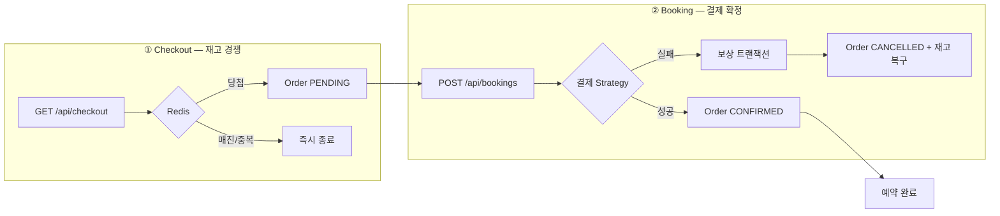
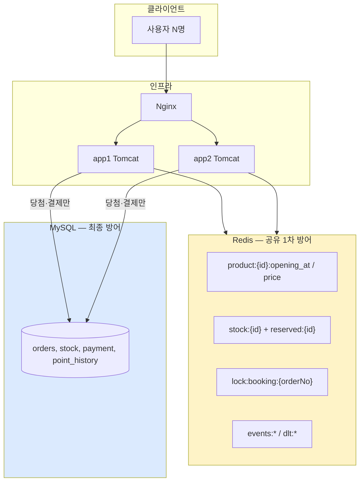
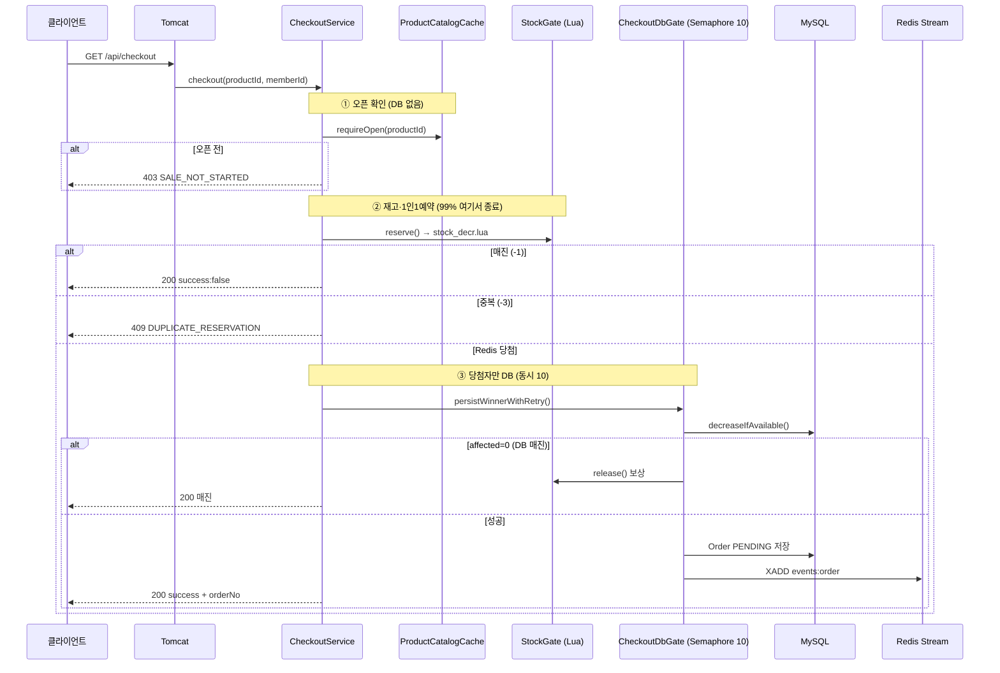
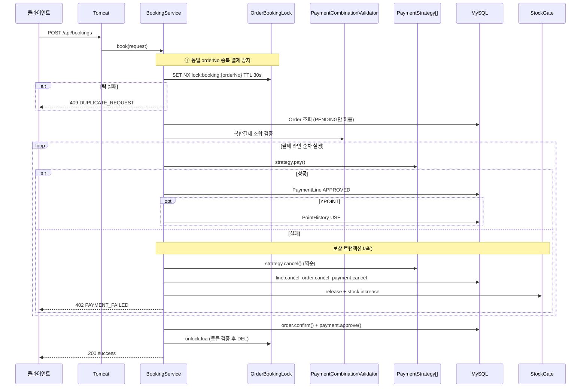
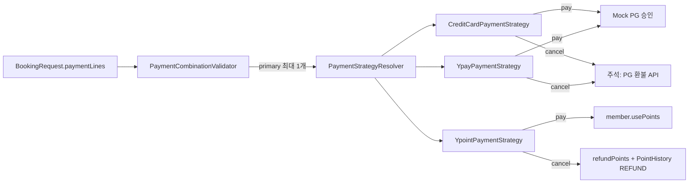
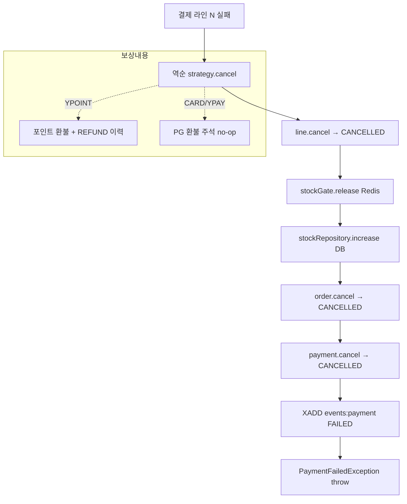
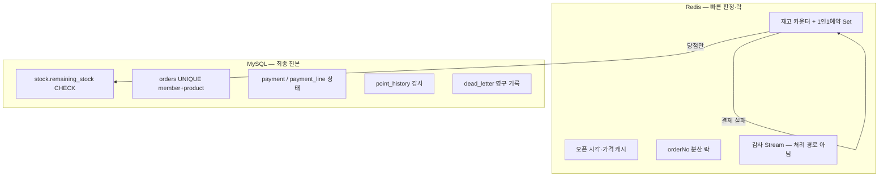
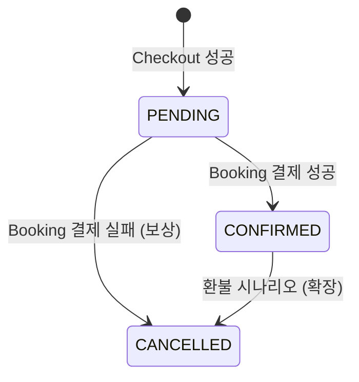

# ReservePay 전체 흐름 상세

[doc1.md](doc1.md)(Redis 키·Lua·Stream) · [doc2.md](doc2.md)(설계 원칙·pgExecutor 제거)를 보완하는 **엔드투엔드 흐름** 문서입니다.  
`stock_decr.lua` 단계별 해설, `CheckoutDbGate` 재시도, 복합결제 요청 예시는 [doc4_etc.md](doc4_etc.md)를 참고하세요.

---

## 한 줄 요약

**Tomcat 동기 HTTP → Redis가 1차 문지기(매진·중복·락) → MySQL은 당첨·결제 확정만 → Redis 장애 시 503 fail-closed**

선착순 예약은 **Checkout(재고 경쟁)** 과 **Booking(결제 확정)** 두 단계로 나뉩니다.

---

## 1. 사용자 관점 전체 여정



| 단계 | API | 질문 | 트래픽 규모 |
|------|-----|------|-------------|
| **Checkout** | `GET /api/checkout?productId=&memberId=` | 재고 있나? 1인1예약 가능? | 00시 **500~1000 TPS** |
| **Booking** | `POST /api/bookings` | 이 주문 결제할 수 있나? | 당첨자 **~10건** 수준 |

---

## 2. 시스템 아키텍처 (doc2 원칙 4가지)



| # | 원칙 (doc2) | 의미 |
|---|-------------|------|
| 1 | **실패는 Redis에서 빨리** | 503이 아니라 매진(200) / 중복(409) |
| 2 | **DB는 소수만** | Redis 통과 당첨자 ~10건만 DB |
| 3 | **Redis 장애 fail-closed** | `503 REDIS_UNAVAILABLE` — 판매 중단 |
| 4 | **앱 N대도 같은 Redis** | Lua·Lock으로 분산 정합성 |

---

## 3. Checkout 상세 흐름

### 3-1. 처리 순서



### 3-2. Redis 키 변화 (당첨 시)

```
Before:  stock:1 = "10"     reserved:1 = {}
After:   stock:1 = "9"      reserved:1 = {memberId}
```

`stock_decr.lua`가 **DECR + SADD**를 원자적으로 수행합니다. ([doc4_etc.md](doc4_etc.md) Lua 단계별 참고)

### 3-3. CheckoutDbGate — 왜 필요한가

Redis 당첨 후에도 DB에서 `decreaseIfAvailable`이 0이면(레이스·동기화 지연) **Redis 슬롯을 release**하고 매진 처리합니다.

```
당첨 ~10건 → Semaphore(10) → HikariCP 풀과 맞춤 → DB 과부하 방지
```

재시도·DLT 정책은 [doc4_etc.md](doc4_etc.md) `CheckoutDbGate 재시도` 절을 참고하세요.

### 3-4. Checkout 실패·예외 정리

| 상황 | HTTP | code / body | Redis | DB |
|------|------|-------------|-------|-----|
| 오픈 전 | **403** | `SALE_NOT_STARTED` | 미접촉 | 미접촉 |
| 매진 (Lua) | **200** | `success:false` | Lua만 | 미접촉 |
| 중복 예약 | **409** | `DUPLICATE_RESERVATION` | Lua만 | 미접촉 |
| Redis 장애 | **503** | `REDIS_UNAVAILABLE` | — | 미접촉 |
| 당첨 후 DB 일시 장애 | **200** | "예약에 실패하셨습니다." | 슬롯 **유지** + 재시도 | DLT 기록 |
| 당첨 후 DB 최종 포기 | **200** | "예약에 실패하셨습니다." | `release` | `booking_dead_letter` |
| UNIQUE 위반 (멱등) | **409** | `DUPLICATE_RESERVATION` | `release` + DB increase | 롤백 |

---

## 4. Booking 상세 흐름

### 4-1. 처리 순서



### 4-2. 결제 Strategy ([Strategy 패턴])



**복합결제 규칙**
- primary(카드·Y페이) **최대 1개** — 카드+Y페이 동시 사용 불가
- Y포인트 + 카드(또는 Y페이) 조합 허용
- 라인 합계 = 주문 금액

요청 body 예시는 [doc4_etc.md](doc4_etc.md) `복합결제 예시` 절을 참고하세요.

### 4-3. Booking 실패·예외 정리

| 상황 | HTTP | 비고 |
|------|------|------|
| 동시 결제 (같은 orderNo) | **409** | `DUPLICATE_REQUEST` |
| 주문 없음 | **404** | `ORDER_NOT_FOUND` |
| PENDING 아님 | **409** | `INVALID_ORDER_STATE` |
| 결제 조합 오류 | **422** | `INVALID_PAYMENT_COMBINATION` |
| 결제 실패 | **402** | `PAYMENT_FAILED` + 보상 실행 |
| Redis 장애 | **503** | `REDIS_UNAVAILABLE` |

---

## 5. 보상 트랜잭션 (결제 실패 시)

`BookingService.fail()` — **역순** 보상:



| 시나리오 | succeededLines | 보상 내용 |
|----------|----------------|-----------|
| **첫 결제 실패** (포인트 부족) | 없음 | 재고·주문·결제만 취소, 포인트 변동 없음 |
| **두 번째 실패** (Y포인트 성공 → 카드 실패) | Y포인트 1건 | 포인트 환불 + USE/REFUND 이력 + 재고 복구 |

`@Transactional(noRollbackFor = PaymentFailedException.class)` — 예외가 나도 **보상 결과는 DB에 커밋**됩니다.

검증 테스트: `BookingCompensationIntegrationTest`

---

## 6. Redis vs MySQL 역할 분리



**이중 안전망**
1. **Redis** — 폭주 흡수, ms 단위 fast-fail
2. **MySQL** — `UNIQUE`, 조건부 `UPDATE`, 트랜잭션으로 초과판매 차단

---

## 7. Audit Stream 역할 (처리 경로 아님)

| 시점 | `events:order` | `events:payment` | DLT |
|------|----------------|------------------|-----|
| Checkout 성공 | `PENDING` | — | — |
| Checkout DB 장애 | — | — | `dlt:booking` |
| Booking 성공 | — | `APPROVED` | — |
| Booking 실패 | — | `FAILED` | `dlt:payment` |

DB `orders.status`가 최종 진본이고, Stream은 **감사·구독용**입니다. Booking에서 `events:order`에 중복 기록하지 않습니다.

---

## 8. 00시 버스트 — pgExecutor 제거 (doc2)

```
구 방식:  pgExecutor(스레드 10 + 큐 200) → 1000 TPS 중 ~790건이 Redis 도달 전 503
현재:     Tomcat 동기 → 전 요청이 Redis Lua 통과 → 99% 매진/중복으로 즉시 종료
          통과 ~10건만 CheckoutDbGate → DB
```

| | 구 `pgExecutor` | 현재 |
|--|----------------|------|
| 버스트 처리 | 풀 상한에서 503 | **Redis Lua fast-fail** |
| DB 부하 | 모든 요청 경로 가능 | **당첨 ~10건만** |
| 복잡도 | CompletableFuture + 별도 풀 | **Tomcat 동기 단일 경로** |

**Redis lock** = 같은 `orderNo` 중복 결제 방지 (정합성)  
**pgExecutor** = 스레드 풀 분리 (인프라) → **제거됨, 대체 관계 아님**

---

## 9. 상태 전이 요약



| 엔티티 | 성공 경로 | 실패(보상) 경로 |
|--------|-----------|-----------------|
| `Order` | PENDING → **CONFIRMED** | PENDING → **CANCELLED** |
| `Payment` | PENDING → **APPROVED** | PENDING → **CANCELLED** |
| `PaymentLine` | **APPROVED** | APPROVED → **CANCELLED** |
| `stock` (Redis+DB) | -1 | +1 (release) |
| `PointHistory` | **USE** | **REFUND** (Y포인트만) |

---

## 10. 검증 테스트 매핑

| 테스트 | 검증 내용 |
|--------|-----------|
| `ConcurrentCheckoutIntegrationTest` | HTTP 응답·50명 동시 Checkout·재고 10개 |
| `DistributedStockConsistencyTest` | 앱 2대 시뮬레이션 1000동시·Redis+DB 정합성 |
| `CheckoutSaleNotStartedTest` | `Product.isSaleOpen()` false 시 재고 미접촉 |
| `BookingCompensationIntegrationTest` | 보상 트랜잭션 (포인트·재고·CANCELLED) |
| `PaymentCombinationValidatorTest` | 복합결제 규칙 |
| `YpointPaymentStrategyTest` | 포인트 pay/cancel |
| `ReservePayExceptionTest` | HTTP 상태·code API 계약 |

---

## 관련 문서

| 문서 | 내용 |
|------|------|
| [doc1.md](doc1.md) | Redis 키·Lua·Stream·Checkout/Booking Redis 상세 |
| [doc2.md](doc2.md) | 설계 원칙 4가지·pgExecutor 제거·아키텍처 단순화 |
| [doc4_etc.md](doc4_etc.md) | `stock_decr.lua` 단계별·`CheckoutDbGate` 재시도·복합결제 body 예시 |
| [API.md](API.md) | HTTP API 스펙 |
