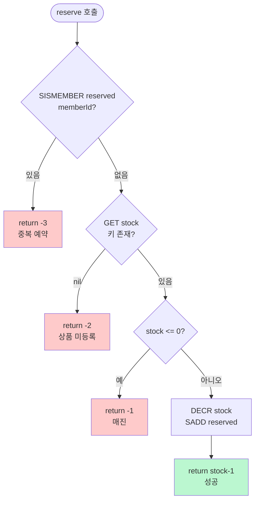
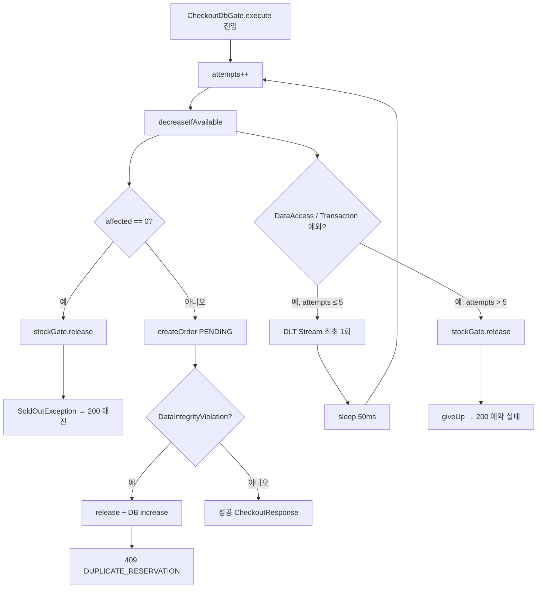

# ReservePay 부가 상세 — Lua · DB Gate · 복합결제

[doc3_detail.md](doc3_detail.md) 전체 흐름을 보완하는 **구현 단위 상세** 문서입니다.

---

## 1. `stock_decr.lua` 단계별

**파일:** `src/main/resources/scripts/stock_decr.lua`  
**호출:** `StockGate.reserve(productId, memberId)`

### 1-1. 왜 Lua인가

Redis 단일 명령은 원자적이지만, `GET` → `DECR` → `SADD`를 나눠 실행하면 그 사이 다른 요청이 끼어들 수 있습니다.  
Lua 스크립트는 **실행 전체가 원자 단위**이므로 선착순 경쟁에서 초과판매를 막습니다.

### 1-2. 키·인자

| | 값 | 설명 |
|---|---|---|
| `KEYS[1]` | `stock:{productId}` | 남은 재고 수 (정수 문자열). `StockBootstrapRunner`가 DB와 동기화 |
| `KEYS[2]` | `reserved:{productId}` | 해당 상품 당첨 memberId 집합 (SET) |
| `ARGV[1]` | `memberId` | 예약 시도 회원 ID (문자열) |

### 1-3. 처리 순서 (의도적으로 이 순서)



**1단계 — 1인 1예약 검사 (재고보다 먼저)**

```lua
if redis.call('SISMEMBER', KEYS[2], ARGV[1]) == 1 then
    return -3
end
```

이미 `reserved`에 있으면 재고와 무관하게 거절합니다. 동일 회원의 중복 Checkout을 막습니다.

**2단계 — 재고 키 존재 여부**

```lua
local stock = tonumber(redis.call('GET', KEYS[1]))
if stock == nil then
    return -2
end
```

`stock:{id}` 키가 없으면 부트스트랩 미완료·상품 미등록으로 간주합니다.

**3단계 — 매진 검사**

```lua
if stock <= 0 then
    return -1
end
```

**4단계 — 원자 차감 + 당첨자 등록**

```lua
redis.call('DECR', KEYS[1])
redis.call('SADD', KEYS[2], ARGV[1])
return stock - 1
```

차감 전 값 `stock`을 기준으로 `stock - 1`을 반환합니다 (예: 10 → 9).

### 1-4. 반환값 → Java 예외

| Lua 반환 | `StockGate` 해석 | HTTP |
|----------|------------------|------|
| 양수 | 성공 (차감 후 잔여 재고) | 200 success |
| `-1` | `SoldOutException` | **200** `success:false` |
| `-2` | `ProductNotFoundException` | **404** |
| `-3` | `DuplicateReservationException` | **409** |

### 1-5. 보상 (역방향)

결제 실패·Checkout 포기 시 `StockGate.release()`:

```
SREM reserved:{productId} memberId
INCR stock:{productId}
```

Booking 보상·Checkout DB 최종 포기·DB 매진 백스톱 실패 시 호출됩니다.

### 1-6. 실행 예시 (재고 10, member 5·7·5 순 요청)

| 순서 | memberId | 결과 | stock | reserved |
|------|----------|------|-------|----------|
| 1 | 5 | 성공 (9) | 9 | {5} |
| 2 | 7 | 성공 (8) | 8 | {5,7} |
| 3 | 5 | **-3** 중복 | 8 | {5,7} |
| … | … | … | … | … |
| 11 | 99 | **-1** 매진 | 0 | {10명} |

---

## 2. `CheckoutDbGate` 재시도

**파일:** `checkout/CheckoutDbGate.java`, `checkout/CheckoutService.java`

### 2-1. CheckoutDbGate 역할

```java
// Semaphore(10) — HikariCP 풀 크기와 동일
permits.acquire();
try {
    return action.call();  // persistWinnerWithRetry()
} finally {
    permits.release();
}
```

Redis Lua를 통과한 **당첨 소수(~재고 수)** 만 DB에 들어갑니다.  
동시 DB 접속을 10으로 제한해 커넥션 풀 고갈을 방지합니다.

### 2-2. persistWinnerWithRetry 흐름



### 2-3. 재시도 정책 상수

| 상수 | 값 | 의미 |
|------|-----|------|
| `MAX_RETRIES` | 5 | DB 일시 장애 시 최대 시도 횟수 |
| `RETRY_BACKOFF_MS` | 50 | 재시도 간 대기 |
| `MAX_CONCURRENT_DB_CHECKOUTS` | 10 | Semaphore 동시 DB 처리 수 |

### 2-4. Redis 슬롯 유지 vs release

| 상황 | Redis `reserved` / `stock` | 이유 |
|------|---------------------------|------|
| DB **일시** 장애 (재시도 중) | **유지** | 일시 장애 후 재시도로 주문 생성 가능 |
| DB **최종** 포기 (5회 초과) | **release** | 슬롯 반환, 사용자에게 "예약에 실패하셨습니다." |
| `decreaseIfAvailable` 0건 | **release** | Redis·DB 불일치 시 매진 처리 |
| `DataIntegrityViolation` | **release** + DB increase | UNIQUE 충돌(멱등·1인1예약) |

### 2-5. DLT (Dead Letter)

재시도 중 **최초 1회만**:
- Redis Stream: `dlt:booking`
- MySQL: `booking_dead_letter` (최종 포기 시 `giveUp`에서도 저장 시도)

Stream·DLT는 **관측용**이며, 처리 경로를 대체하지 않습니다.

### 2-6. createOrder 성공 시

```java
Order.pending(orderNo, memberId, productId, price, "checkout:{productId}:{memberId}")
orderRepository.save(order)
auditStreamPublisher.orderEvent(orderNo, "PENDING", ...)
```

멱등성 키 `checkout:{productId}:{memberId}` — DB `uk_orders_idem` 백스톱.

---

## 3. 복합결제 예시 요청 body

**API:** `POST /api/bookings`  
**전제:** Checkout으로 `PENDING` 주문·`orderNo` 확보. 시드 상품 가격 **100,000원**.

### 3-1. 공통 규칙 (`PaymentCombinationValidator`)

| 규칙 | 설명 |
|------|------|
| primary 최대 1개 | `CREDIT_CARD`, `YPAY` 중 **동시 사용 불가** |
| YPOINT 보조 | primary 1개 + YPOINT 조합 허용 |
| 금액 합계 | `paymentLines` 합 = 주문 `totalAmount` |
| 금액 양수 | 각 라인 `amount > 0` |
| 라인 1개 이상 | 빈 배열 불가 |

### 3-2. 신용카드 단독 (100,000원)

```json
{
  "orderNo": "4b575809-968a-4966-91af-f4b3e5f085c3",
  "memberId": 1,
  "paymentLines": [
    { "method": "CREDIT_CARD", "amount": 100000 }
  ]
}
```

```bash
curl -X POST http://localhost:8080/api/bookings \
  -H "Content-Type: application/json" \
  -d '{
        "orderNo": "4b575809-968a-4966-91af-f4b3e5f085c3",
        "memberId": 1,
        "paymentLines": [
          { "method": "CREDIT_CARD", "amount": 100000 }
        ]
      }'
```

### 3-3. Y포인트 단독 (100,000원)

회원 `point_balance` ≥ 100,000 필요.

```json
{
  "orderNo": "4b575809-968a-4966-91af-f4b3e5f085c3",
  "memberId": 1,
  "paymentLines": [
    { "method": "YPOINT", "amount": 100000 }
  ]
}
```

### 3-4. 카드 + Y포인트 복합 (80,000 + 20,000)

```json
{
  "orderNo": "4b575809-968a-4966-91af-f4b3e5f085c3",
  "memberId": 1,
  "paymentLines": [
    { "method": "CREDIT_CARD", "amount": 80000 },
    { "method": "YPOINT", "amount": 20000 }
  ]
}
```

**실행 순서:** 요청 배열 순서대로 결제  
1. `CreditCardPaymentStrategy.pay()` → Mock PG 승인  
2. `YpointPaymentStrategy.pay()` → `member.usePoints(20000)` + `PointHistory USE`

두 번째 라인 실패 시 → 첫 라인 역순 `cancel()` 보상 (`BookingCompensationIntegrationTest` 참고).

### 3-5. Y페이 + Y포인트 복합 (70,000 + 30,000)

```json
{
  "orderNo": "4b575809-968a-4966-91af-f4b3e5f085c3",
  "memberId": 1,
  "paymentLines": [
    { "method": "YPAY", "amount": 70000 },
    { "method": "YPOINT", "amount": 30000 }
  ]
}
```

### 3-6. 거부되는 조합 예시

**카드 + Y페이 동시 (422 INVALID_PAYMENT_COMBINATION)**

```json
{
  "orderNo": "4b575809-968a-4966-91af-f4b3e5f085c3",
  "memberId": 1,
  "paymentLines": [
    { "method": "CREDIT_CARD", "amount": 50000 },
    { "method": "YPAY", "amount": 50000 }
  ]
}
```

**합계 불일치 (422)**

```json
{
  "orderNo": "4b575809-968a-4966-91af-f4b3e5f085c3",
  "memberId": 1,
  "paymentLines": [
    { "method": "CREDIT_CARD", "amount": 50000 }
  ]
}
```
→ 주문 금액 100,000원인데 합계 50,000원.

### 3-7. 전체 시나리오 (Checkout → Booking)

```bash
# 1. 주문 생성 (재고 선점)
ORDER_NO=$(curl -s "http://localhost:8080/api/checkout?productId=1&memberId=1" \
  | python3 -c "import sys,json;print(json.load(sys.stdin)['orderNo'])")

# 2. 복합결제 확정
curl -X POST http://localhost:8080/api/bookings \
  -H "Content-Type: application/json" \
  -d "{
    \"orderNo\": \"$ORDER_NO\",
    \"memberId\": 1,
    \"paymentLines\": [
      { \"method\": \"CREDIT_CARD\", \"amount\": 80000 },
      { \"method\": \"YPOINT\", \"amount\": 20000 }
    ]
  }"
```

### 3-8. 성공·실패 응답 예시

**성공 (200)**

```json
{
  "orderNo": "4b575809-968a-4966-91af-f4b3e5f085c3",
  "status": "CONFIRMED",
  "success": true,
  "message": null
}
```

**결제 실패 (402) — 보상 완료 후**

```json
{
  "orderNo": "4b575809-968a-4966-91af-f4b3e5f085c3",
  "status": "FAILED",
  "success": false,
  "message": "포인트 잔액이 부족합니다."
}
```

> DB에는 `order.status = CANCELLED`로 저장됩니다. API 응답 `status`는 `FAILED` — [doc3_detail.md](doc3_detail.md) 상태 전이 참고.

---

## 관련 문서

| 문서 | 내용 |
|------|------|
| [doc3_detail.md](doc3_detail.md) | 전체 흐름·보상·아키텍처 |
| [doc1.md](doc1.md) | Redis 키·Stream |
| [API.md](API.md) | HTTP API 전체 스펙 |
